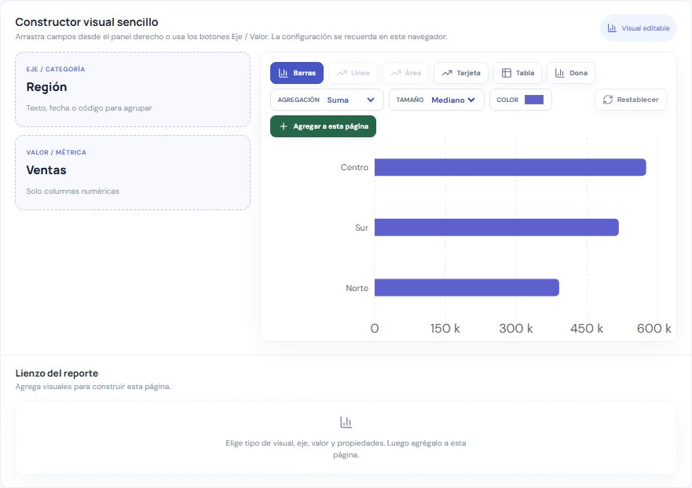
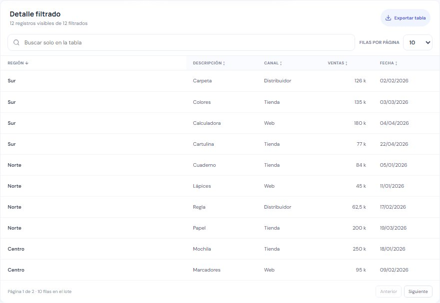
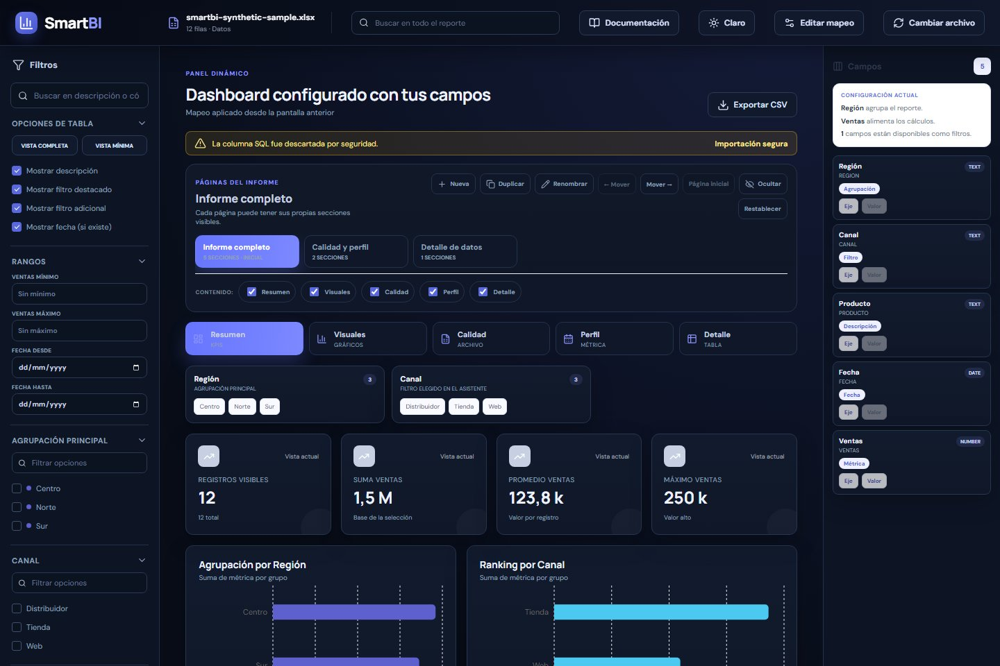

# Manual final de usuario — SmartBI

## 1. ¿Qué es SmartBI?

SmartBI es una aplicación web para cargar un archivo Excel tabular y construir un dashboard dinámico sin depender de una plantilla fija.

La idea es sencilla:

1. Cargas un archivo `.xlsx`.
2. SmartBI lee las columnas.
3. Tú eliges qué columna agrupa, qué columna suma y qué columnas sirven como filtros.
4. La aplicación genera gráficos, indicadores, tabla y reporte de calidad.

SmartBI procesa el archivo en el navegador. Para esta versión demo no usa usuarios, base de datos ni servidor de almacenamiento.

## 2. Antes de empezar

Este manual incluye diez capturas reales de SmartBI, tomadas con **datos
inventados de una papelería**. No representan información de ninguna empresa.
Las columnas de tu archivo pueden llamarse de otra manera: los controles serán
los mismos, pero tú elegirás tus propios campos.

Dentro de la aplicación puedes pulsar una imagen para abrirla en tamaño
completo en otra pestaña y leer los controles con más comodidad.

Tu Excel debe tener forma de tabla:

- Una fila de encabezados.
- Columnas con nombres claros.
- Filas de datos debajo.
- Al menos una columna útil para agrupar, por ejemplo cliente, ciudad, categoría, proveedor, estado o tipo.
- Al menos una columna numérica para calcular, por ejemplo valor, total, cantidad, ventas, costo o puntaje.

No es obligatorio que el archivo tenga nombres específicos. El usuario decide en el asistente qué columnas usar.

Si dos columnas tienen el mismo encabezado, SmartBI las conserva por separado agregando un número interno, por ejemplo `CATEGORIA` y `CATEGORIA_2`. Si un encabezado está vacío, le asigna un nombre como `Columna 3` para evitar perder sus datos.

## 3. Cargar un Excel

La tarjeta de la derecha es la puerta de entrada. También puedes abrir
Documentación desde la barra superior sin cargar un archivo.

1. Abre SmartBI en el navegador.
2. En la pantalla inicial, arrastra el archivo Excel o usa el selector de archivo.
3. Espera a que SmartBI lea el archivo.
4. Si aparece una advertencia, léela con calma. Una advertencia no siempre significa error grave.

SmartBI puede ignorar columnas sensibles o no recomendadas, como `SQL`, para evitar mostrar información peligrosa o innecesaria.

Si el archivo pesa 8 MB o más, tiene 25.000 filas o 80 columnas, SmartBI mostrará una advertencia. Puedes continuar dentro del límite de 15 MB, pero el tiempo dependerá de la memoria y velocidad del equipo.

## 4. Configurar el dashboard en el wizard

El wizard tiene tres pasos.

### Paso 1 — Agrupación

Aquí eliges cómo se van a juntar los datos.

Ejemplos:

- Por cliente.
- Por ciudad.
- Por proveedor.
- Por categoría.
- Por estado.

También puedes marcar agrupaciones secundarias. Por ejemplo:

`Ciudad > Segmento`

Eso significa que SmartBI primero agrupa por ciudad y luego por segmento.

En nuestro ejemplo elegimos **Región**. Así compararemos Centro, Norte y Sur,
en lugar de crear un gráfico con un grupo por cada producto.

### Paso 2 — Descripción y métrica

Aquí eliges:

- Un texto para mostrar en la tabla.
- Una columna numérica para sumar, comparar o promediar.

Ejemplos de métricas:

- Valor.
- Total.
- Cantidad.
- Ventas.
- Costo.
- Puntaje.

La captura anterior pertenece al paso 2. **Producto** ayuda a reconocer cada
fila; **Ventas** es el número usado en los indicadores. Si quieres estudiar
cantidades, podrías escoger Unidades como métrica.

### Paso 3 — Columnas y filtros

Aquí decides qué columnas adicionales se tendrán en cuenta y cuáles aparecerán como filtros.

Consejo:

- No marques todo si no lo necesitas.
- Marca solo las columnas que realmente ayuden a explorar el archivo.
- Usa “Seleccionar todo” o “Deseleccionar” cuando el archivo tenga muchas columnas.

Aquí marcamos **Canal** para poder elegir después Tienda, Web o Distribuidor.
Las casillas opcionales comienzan vacías: las selecciones de esta imagen las
hizo la persona que preparó el ejemplo. La tarjeta tiene desplazamiento interno
para llegar a las opciones de fecha y a la vista previa.

## 5. Entender el dashboard

El dashboard tiene varias zonas:

Lee de izquierda a derecha: los filtros escogen las filas; el centro cuenta
la historia con números y gráficos; el panel derecho muestra los campos.

### Barra superior

Muestra:

- Nombre del archivo.
- Cantidad de filas.
- Buscador global.
- Botón de documentación.
- Cambio de tema claro/oscuro.
- Editar mapeo.
- Cambiar archivo.

### Panel de filtros

Está a la izquierda en escritorio y se abre con el botón de menú en celulares.

Sirve para reducir los datos visibles.

### Páginas del informe

SmartBI permite organizar el informe en páginas.

Puedes:

- Crear una página nueva.
- Duplicar la página actual.
- Renombrar una página.
- Ocultar una página.
- Restaurar páginas ocultas.
- Mover una página a la izquierda o a la derecha.
- Elegir qué página se abrirá primero.
- Decidir qué secciones aparecen en cada página.
- Tener visuales diferentes en cada página.

Por defecto existen páginas como:

- Informe completo (nombre inicial de la página principal).
- Calidad y perfil.
- Detalle de datos.

### Secciones internas

Cada página puede contener una o varias secciones:

- Resumen: tarjetas KPI.
- Visuales: gráficos y constructor visual.
- Calidad: estado del archivo importado.
- Perfil: distribución de la métrica.
- Detalle: tabla filtrada.

## 6. Usar filtros

Puedes filtrar de varias formas:

- Buscador global.
- Filtros laterales.
- Segmentadores rápidos.
- Clic en gráficos.
- Rangos de métrica.
- Rangos de fecha, si configuraste una columna de fecha.

Cuando hay filtros activos, SmartBI muestra chips para quitarlos uno por uno.

## 7. Constructor visual

El constructor visual permite crear gráficos sencillos.

Puedes elegir:

- Eje o categoría.
- Métrica.
- Tipo de gráfico.
- Agregación: suma, promedio, conteo, máximo o mínimo.
- Color principal.
- Tamaño pequeño, mediano o grande.

Los tipos disponibles son barras, línea, área, dona, tarjeta y tabla. Línea y área se habilitan cuando el eje elegido es una fecha.

También puedes guardar varios visuales en el lienzo del reporte, cambiar su título, editar propiedades, duplicarlos, ordenarlos y decidir en qué página aparecen. Esta configuración se guarda en el navegador mediante LocalStorage.

Prueba pequeña: elige **Barras**, conserva Región y Ventas, cambia el color y
pulsa **Agregar a esta página**. La vista previa no se convierte en un visual
guardado hasta que pulses ese botón.

## 8. Tabla de datos

La tabla permite:

- Buscar dentro de los registros visibles.
- Ordenar columnas.
- Cambiar cantidad de filas por página.
- Exportar la tabla filtrada a CSV.

Los lotes de 100 y 250 filas usan una técnica llamada virtualización: SmartBI dibuja únicamente las filas visibles para evitar que la pantalla se vuelva pesada.

La tabla no modifica el Excel original. Solo muestra una vista filtrada.

Si no encuentras una fila, revisa tanto la búsqueda de la tabla como los filtros
del informe: las dos cosas pueden reducir los resultados.

## 9. Calidad del archivo

La sección de calidad muestra:

- Filas leídas.
- Filas válidas.
- Filas rechazadas.
- Columnas incluidas.
- Columnas ignoradas.
- Advertencias.
- Recomendación de uso para columnas.

También puedes exportar el reporte de calidad.

## 10. Exportar información

SmartBI permite exportar:

- Datos filtrados del dashboard.
- Tabla visible.
- Reporte de calidad.

Los archivos se descargan como CSV.

## 11. Cambiar archivo

Usa “Cambiar archivo” si quieres empezar con otro Excel.

SmartBI te lleva a la pantalla de carga, pero conserva tu dashboard anterior mientras no importes otro archivo correctamente.

Si te arrepientes, usa “Volver al dashboard” para regresar sin perder lo que estabas revisando.

También puedes usar la flecha atrás del navegador mientras estás en esa pantalla; SmartBI entenderá que quieres cancelar el cambio y regresar al dashboard actual.

El archivo anterior solo se reemplaza cuando el nuevo Excel se lee correctamente.

## 12. Editar mapeo

Usa “Editar mapeo” si el dashboard no quedó como esperabas.

Puedes cambiar:

- Agrupación.
- Métrica.
- Descripción.
- Filtros.
- Columnas incluidas.
- Fecha.

No necesitas volver a cargar el archivo para corregir el mapeo.

## 13. Problemas comunes

### No veo buenos gráficos

Revisa si escogiste una métrica numérica correcta.

### Hay demasiados filtros

Vuelve a “Editar mapeo” y deja marcados solo los filtros importantes.

### Una columna aparece como texto pero debería ser número

Revisa el Excel. Puede tener símbolos, espacios, mezclas de letras o separadores decimales inconsistentes.

### El archivo no carga

Verifica que sea `.xlsx`, que no esté vacío y que tenga una tabla clara.

### El dashboard está muy cargado

Usa páginas del informe para separar el contenido:

- Una página para resumen.
- Una página para gráficos.
- Una página para calidad.
- Una página para detalle.

## 14. Buenas prácticas para usuarios

- Empieza con pocos filtros.
- Usa nombres claros en los encabezados del Excel.
- Revisa la sección de calidad antes de tomar decisiones.
- Exporta CSV si necesitas revisar los datos fuera de SmartBI.
- Si algo se ve raro, cambia el mapeo antes de concluir que los datos están mal.

## 15. Usar SmartBI con teclado y tecnologías de asistencia

- Presiona `Tab` para avanzar por controles y `Shift + Tab` para regresar.
- Usa el enlace “Saltar al contenido” que aparece al recibir foco.
- En las pestañas de páginas, usa flechas izquierda/derecha, `Inicio` y `Fin`.
- Las acciones de arrastre también tienen botones equivalentes.
- Los lectores de pantalla reciben nombres de controles, estados de filtros y descripciones de tablas y gráficos.
- SmartBI respeta la preferencia del sistema para reducir movimiento.

## 16. Alcance actual

### Apariencia clara y oscura

El botón del sol o la luna cambia el tema sin cambiar los datos. Puedes usar
el que te resulte más cómodo; la preferencia se recuerda en este navegador.

### Uso en un celular

Las zonas se acomodan verticalmente. El botón de tres líneas abre los filtros;
las pestañas de páginas pueden desplazarse horizontalmente. Baja por la página
para encontrar los indicadores, gráficos y tabla.

### Aprender dentro de SmartBI

Abre **Documentación** para consultar este manual, buscar un tema o seguir la
guía de aprendizaje. Puedes marcar un capítulo como leído; esa marca no cambia
el informe. En el celular usa el botón **Abrir índice** para ver los capítulos.

### Qué no incluye la demo

SmartBI actualmente no incluye:

- Usuarios y contraseñas.
- Base de datos.
- Colaboración multiusuario.
- Conexión directa a sistemas externos.
- Inteligencia artificial.
- Edición del Excel original.

Es una aplicación demo completa orientada a análisis local de archivos Excel.
